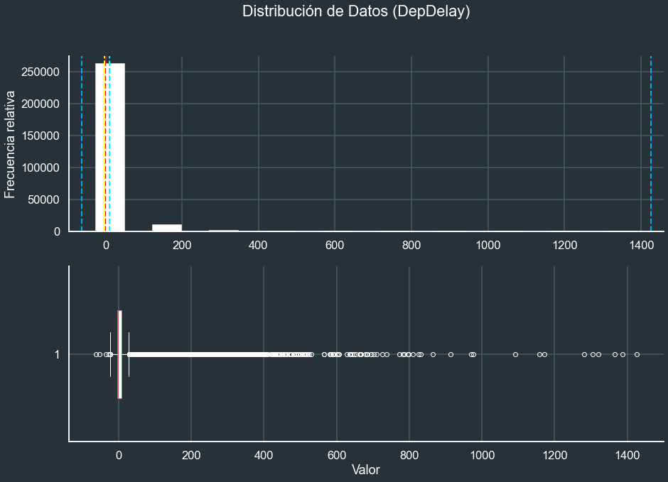
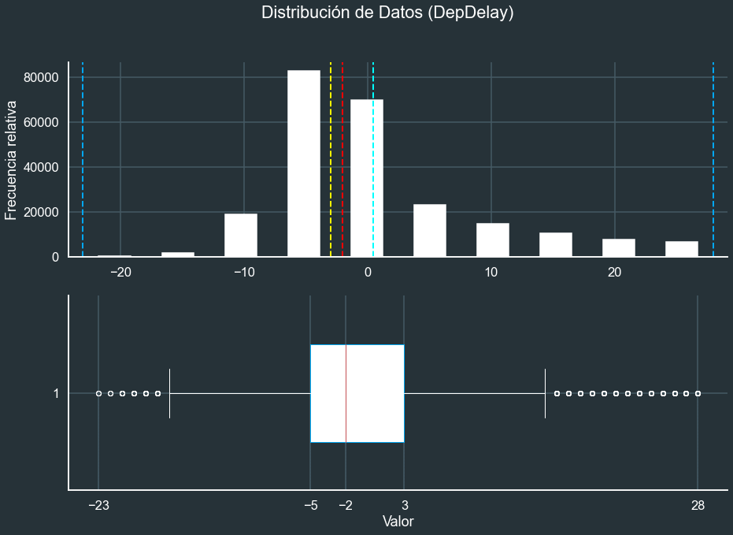
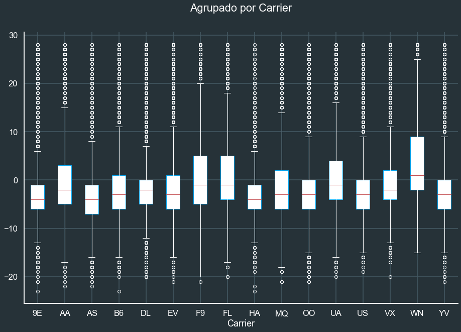

# Manejando valores atípicos en un Dataset de AML con Python (On-Premise)

Dentro del proceso de la ciencia de datos, la limpieza de datos suele ser la etapa que más tiempo consume. A menos que sea necesario por limitaciones físicas, completar toda  esta tarea con computo en la nube puede ser una vía poco económica a comparación de hacerlo on-premise.

## Pre-requisitos

Este proyecto se desarrolló en Python 3.8.5 usando los paquetes **azureml.core**, **matplotlib**, **seaborn** y **numpy**.

Debemos asegurarnos de también instalar los paquetes del runtime de **azureml-dataset** de la siguiente manera:

<pre><code>pip install azureml-dataset-runtime --upgrade</code></pre>

## Conectar con nuestro Azure ML Workspace

Según la documentación oficial[[1]], existen muchas formas de autenticarnos para nuestro Azure ML Workspace:

* Interactive Login Authentication
* Azure CLI Authentication
* Managed Service Identity (MSI) Authentication
* Service Principal Authentication
* Token Authentication

En esta ocasión trabajaremos con **Interactive Login Authentication** de la siguiente manera:

<pre><code>from azureml.core import Workspace, Datastore, Dataset
from azureml.core.authentication import InteractiveLoginAuthentication

tenant_id = '[TENANT_ID]'
subscription_id = '[SUBSCRIPTION_ID]'
resource_group = 'rg-datascience-machinelearning-peru'
workspace_name = 'mlw-msftlearn-dp100'

interactive_auth = InteractiveLoginAuthentication(tenant_id=tenant_id)
workspace = Workspace(subscription_id, resource_group, workspace_name, interactive_auth)
</code></pre>

## Visualizar distribución de datos en el Dataset

Empecemos definiendo los scripts que nos ayudaran a presentar visualmente la distribución de una variable numérica:

<pre><code>from matplotlib import pyplot as plt
import seaborn as sns
import numpy as np

plt.ioff()
sns.set_style("darkgrid")
sns.set(rc={'axes.facecolor':'#263238', 'figure.facecolor':'#263238'})
sns.set_context('talk')

def show_distribution(variable,var_data,show_quantiles=False):

    # Estadística
    min_val = var_data.min()
    max_val = var_data.max()
    mean_val = var_data.mean()
    med_val = var_data.median()
    mod_val = var_data.mode()[0]

    # Figure para 2 subplots (2 filas, 1 columna)
    fig, ax = plt.subplots(2, 1, figsize = (15,10))

    # Histogram   
    ax[0].hist(var_data,color='w',rwidth=0.5)
    ax[0].set_ylabel('Frecuencia relativa', color='white')

    ax[0].axvline(x=min_val, color = '#03A7F2', linestyle='dashed', linewidth = 2)
    ax[0].axvline(x=mean_val, color = 'cyan', linestyle='dashed', linewidth = 2)
    ax[0].axvline(x=med_val, color = 'red', linestyle='dashed', linewidth = 2)
    ax[0].axvline(x=mod_val, color = 'yellow', linestyle='dashed', linewidth = 2)
    ax[0].axvline(x=max_val, color = '#03A7F2', linestyle='dashed', linewidth = 2)

    ax[0].tick_params(axis='x', colors='white',labelrotation=0)
    ax[0].tick_params(axis='y', colors='white')
    ax[0].grid(color='#455A64')

    # Boxplot
    c = "white"
    ax[1].boxplot(var_data, patch_artist=True, vert=False, widths=0.5, whis=1.5,
                boxprops=dict(facecolor=c, color='#03A7F2'),
                capprops=dict(color=c),
                whiskerprops=dict(color=c),
                flierprops=dict(color=c, markeredgecolor=c),
                medianprops=dict(color='r'))

    ax[1].set_xlabel('Valor', color='white')
    ax[1].tick_params(axis='x', colors='white',labelrotation=0)
    ax[1].tick_params(axis='y', colors='white')
    ax[1].grid(color='#455A64')

    if show_quantiles:
        quantiles = np.quantile(var_data, np.array([0.00, 0.25, 0.50, 0.75, 1.00]))
        ax[1].set_xticks(quantiles)
        ax[1].vlines(quantiles, [0] * quantiles.size, [1] * quantiles.size, color='b', ls=':', lw=0.5, zorder=0)
        ax[1].set_ylim(0.5, 1.5)

    fig.suptitle(f'Distribución de Datos ({variable})', color='white')

    sns.despine(left=False, bottom=False)
    plt.show()</code></pre>

Con esto ya podemos visualizar nuestros datos, vale mencionar que el **Dataset** debe encontrarse previamente registrado en el Azure ML Workspace al que nos estamos conectando.

<pre><code>challenge_flight_df = Dataset.get_by_name(workspace,'challenge-flight').to_pandas_dataframe()

show_distribution('DepDelay',challenge_flight_df.DepDelay)</code></pre>

## Limpiar valores atípicos

Existen muchas formas de definir un algoritmo que limpie los valores atípicos, el siguiente código es largo, pero explica paso a paso el proceso de limpieza.

Empezamos calculando el rango intercuartílico y las puertas de valores atipícos con un factor de 1.5. Seguido marcamos los datos fuera de rango con **np.nan** para finalmente soltarlos con la funcion **dropna()** del **Dataframe**.

<pre><code>column = 'DepDelay'

challenge_flight_clean_df = challenge_flight_df.copy()

q75,q25 = np.percentile(challenge_flight_clean_df.loc[:,column],[75,25])
intr_qr = q75-q25
 
max = q75+(1.5*intr_qr)
min = q25-(1.5*intr_qr)
 
challenge_flight_clean_df.loc[challenge_flight_clean_df[column] < min,column] = np.nan
challenge_flight_clean_df.loc[challenge_flight_clean_df[column] > max,column] = np.nan

challenge_flight_clean_df.dropna(axis=0,inplace=True)</code></pre>

Ahora veremos algo más uniforme y, naturalmente, encontraremos nuevos valores atípicos.

<pre><code>show_distribution('DepDelay',challenge_flight_clean_df.DepDelay,True)</code></pre>

## Visualizar datos agrupados

Utilicemos nuestros nuevos datos para mostrarlos de forma agrupada en diagramas de cajas y bigotes.

<pre></code>plt.clf()

fig, ax = plt.subplots(1, 1, figsize = (15,10))
c = 'white'
challenge_flight_clean_df.boxplot(ax=ax,column='DepDelay',by='Carrier',patch_artist=True,vert=True,widths=0.5,whis=1.5,
                boxprops=dict(facecolor=c, color='#03A7F2'),
                capprops=dict(color=c),
                whiskerprops=dict(color=c),
                flierprops=dict(color=c, markeredgecolor=c),
                medianprops=dict(color='r'))
fig.suptitle(f'Agrupado por Carrier', color='white')
ax.set_title('')

ax.set_xlabel('Carrier', color='white')
ax.tick_params(axis='x', colors='white',labelrotation=0)
ax.tick_params(axis='y', colors='white')
ax.grid(color='#455A64')
sns.despine(left=False, bottom=False)</code></pre>

Gracias a la limpieza que hicimos, ahora nos es mucho más fácil encontrar cual aerolinea es la que tiene el retraso en la salida promedio más bajo.

## Subir nuevo dataset luego de la limpieza

Aún queda mucho por limpiar y visualizar, sin embargo podemos ir guardando el progreso en nuestro Azure ML Workspace.

Guardamos localmente el nuevo .csv generado para subirlo al  **Datastore** de preferencia a través del siguiente código:

<pre><code>local_path = 'output/flights_cleaned.csv'
challenge_flight_clean_df.to_csv(local_path)
datastore = Datastore.get(workspace,'workspaceblobstore')
datastore.upload(src_dir='output',target_path='')</pre></code>

Para que finalmente desde ahí, ya podamos registrarlo como un **Dataset** en nuestro Azure ML Workspace.

<pre><code>dataset = Dataset.Tabular.from_delimited_files(datastore.path('flights_cleaned.csv'))
dataset = dataset.register(workspace, 'Flights cleaned')</pre></code>

## Referencias

1. Authentication in Azure Machine Learning. https://github.com/Azure/MachineLearningNotebooks/blob/master/how-to-use-azureml/manage-azureml-service/authentication-in-azureml/authentication-in-azureml.ipynb

[1]: https://github.com/Azure/MachineLearningNotebooks/blob/master/how-to-use-azureml/manage-azureml-service/authentication-in-azureml/authentication-in-azureml.ipynb